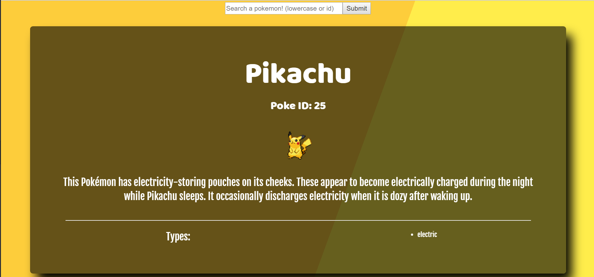

## PokeApp
Search for your favorite Pokémon!
Uses the [PokeAPI](https://pokeapi.co/) to fetch data through a Promise based axios get call.

## Screenshot
View this project [here](http://aaronmassey.pro/180Websites/Day-44/)

## Tech/Framework
* HTML
* CSS
* Bootstrap/React-Bootstrap
* Animate.css
* JavaScript
* ReactJs

## Credits
This project was bootstrapped with [Create React App](https://github.com/facebookincubator/create-react-app).

Below you will find some information on how to perform common tasks. 
You can find the most recent version of this guide [here](https://github.com/facebookincubator/create-react-app/blob/master/packages/react-scripts/template/README.md).
